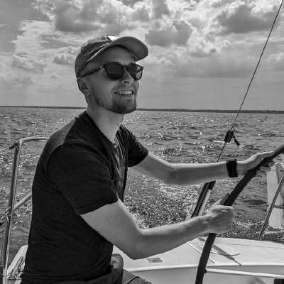

I am a firmware engineer based in the Chicago area with a passion for development. The entire software stack fascinates me. From writing low-level embedded software, to doing web design, I'm into it all.

I have electrical engineering background, studying at Case Western Reserver University. My original plan was to become an analog hardware engineer. But, after taking several software classes as electives, I discovered it's where my true passion is. 

I tend to work on many projects at once and chip away at them over time. I hope to use this site as a place for accountability and to store knowledge.

Feel free to check me out on [LinkedIn](https://www.linkedin.com/in/nathan-mack-6aa293140?original_referer=https%3A%2F%2Fwww.google.com%2F)!
